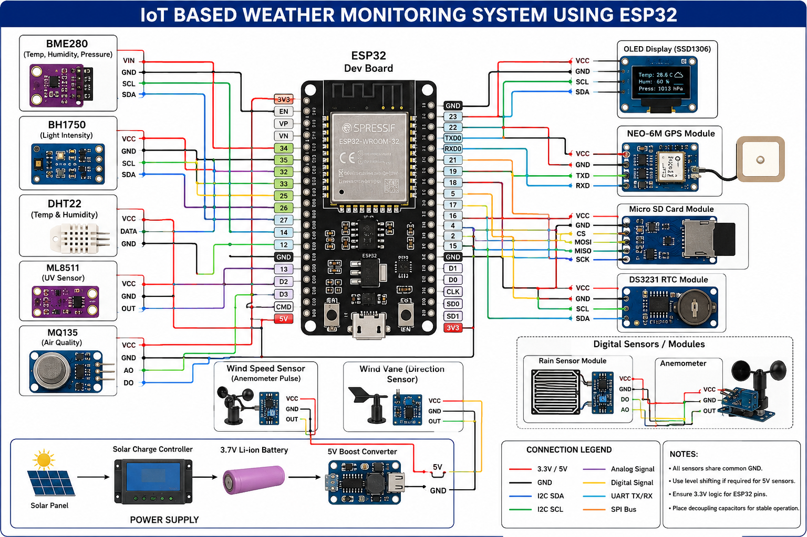

# 🌦️ ESP32 IoT Weather Monitoring System

An advanced IoT-based Weather Monitoring Station built using the ESP32 microcontroller and multiple environmental sensors. The system collects real-time weather and environmental data, displays measurements on an OLED display, stores data on an SD card, and transmits telemetry to cloud platforms using MQTT.


---

## 📌 Project Overview

The ESP32 Weather Monitoring System is designed for:

- Smart Agriculture
- Smart Cities
- Environmental Monitoring
- Industrial IoT Applications
- Research Projects
- Educational Learning
- Weather Forecasting Systems

The system continuously monitors environmental conditions and uploads data to cloud dashboards for remote access and analysis.

---

## 🚀 Features

- Real-Time Weather Monitoring
- ESP32-Based IoT Architecture
- Wi-Fi Connectivity
- MQTT Cloud Communication
- OLED Local Display
- GPS Location Tracking
- SD Card Data Logging
- Air Quality Monitoring
- Rain Detection
- Light Intensity Measurement
- Atmospheric Pressure Monitoring
- Modular Firmware Architecture
- Edge Computing Ready
- Cloud Dashboard Integration

---

## 📊 Parameters Monitored

| Parameter            | Sensor      |
| -------------------- | ----------- |
| Temperature          | BME280      |
| Humidity             | BME280      |
| Atmospheric Pressure | BME280      |
| Light Intensity      | BH1750      |
| Air Quality Index    | MQ135       |
| Rain Detection       | Rain Sensor |
| GPS Latitude         | NEO-6M GPS  |
| GPS Longitude        | NEO-6M GPS  |

---

## 🛠 Hardware Components

### Controller

- ESP32 DevKit V1

### Sensors

- BME280 Environmental Sensor
- BH1750 Light Sensor
- MQ135 Air Quality Sensor
- Rain Sensor Module
- NEO-6M GPS Module

### Display

- SSD1306 OLED Display

### Storage

- Micro SD Card Module

### Communication

- Wi-Fi (Built-in ESP32)

### Power System

- 5V Supply
- Li-Ion Battery (Optional)
- Solar Power System (Optional)

---

## 📂 Project Structure

```text
WeatherStation/
│
├── LICENSE
├── README.md
├── platformio.ini
│
├── firmware/
│   │
│   ├── main.cpp
│   │
│   ├── config/
│   │   ├── config.h
│   │   └── secrets.h
│   │
│   ├── sensors/
│   │   ├── bme280.h
│   │   ├── bme280.cpp
│   │   ├── bh1750.h
│   │   ├── bh1750.cpp
│   │   ├── mq135.h
│   │   ├── mq135.cpp
│   │   ├── rain.h
│   │   ├── rain.cpp
│   │   ├── gps.h
│   │   └── gps.cpp
│   │
│   ├── communication/
│   │   ├── wifi.h
│   │   ├── wifi.cpp
│   │   ├── mqtt.h
│   │   ├── mqtt.cpp
│   │   ├── cloud.h
│   │   └── cloud.cpp
│   │
│   ├── display/
│   │   ├── oled.h
│   │   └── oled.cpp
│   │
│   ├── storage/
│   │   ├── sdcard.h
│   │   └── sdcard.cpp
│   │
│   └── data/
│       └── WeatherData.h
|── circuit_diagram.png

```

---

## 🔌 Sensor Connections

| Module         | ESP32 Pin |
| -------------- | --------- |
| BME280 SDA     | GPIO21    |
| BME280 SCL     | GPIO22    |
| BH1750 SDA     | GPIO21    |
| BH1750 SCL     | GPIO22    |
| MQ135 AO       | GPIO34    |
| Rain Sensor AO | GPIO35    |
| GPS TX         | GPIO16    |
| GPS RX         | GPIO17    |
| SD Card CS     | GPIO5     |
| OLED SDA       | GPIO21    |
| OLED SCL       | GPIO22    |

---

## ⚙️ Software Stack

### Firmware

- Arduino Framework
- ESP-IDF Compatible
- PlatformIO

### Communication

- Wi-Fi
- MQTT
- HTTP REST API

### Cloud Platforms

- ThingsBoard
- Blynk
- AWS IoT Core
- Firebase
- Node-RED

### Data Storage

- SD Card
- Cloud Database

---

## 📡 MQTT Topics

### Publish Topics

```text
weather/data
weather/status
weather/location
```

### Example JSON Payload

```json
{
  "temperature": 29.4,
  "humidity": 68.5,
  "pressure": 1012.7,
  "light": 452,
  "airQuality": 315,
  "rain": 0,
  "latitude": 28.6139,
  "longitude": 77.209
}
```

---

## 🔧 Installation

### Clone Repository

```bash
git clone https://github.com/ShivamMathtech/IOT-BASED-WEATHER-MONITORING-SYSTEM
```

### Open Project

```bash
cd WeatherStation
```

### Install Dependencies

```bash
pio lib install
```

### Build Firmware

```bash
pio run
```

### Upload Firmware

```bash
pio run --target upload
```

### Open Serial Monitor

```bash
pio device monitor
```

---

## 📈 Future Enhancements

- LoRaWAN Support
- Edge AI Weather Prediction
- Wind Speed Monitoring
- Wind Direction Monitoring
- UV Index Detection
- OTA Firmware Updates
- Machine Learning Forecasting
- Mobile Application
- Web Dashboard
- Solar Power Optimization

---

## 🧠 Learning Outcomes

This project demonstrates:

- Embedded Systems Development
- ESP32 Programming
- Sensor Interfacing
- MQTT Communication
- Cloud IoT Integration
- Data Logging Systems
- Real-Time Monitoring
- Industrial IoT Architecture

---

## 📜 License

This project is licensed under the MIT License.

See the `LICENSE` file for details.

---

## 👨‍💻 Author

**Shivam Singh**

Embedded Systems | IoT | AI | Robotics | Computer Vision

---

## ⭐ Support

If you find this project useful:

- Star the repository
- Fork the project
- Submit improvements
- Share with the community

Happy Building! 🚀
